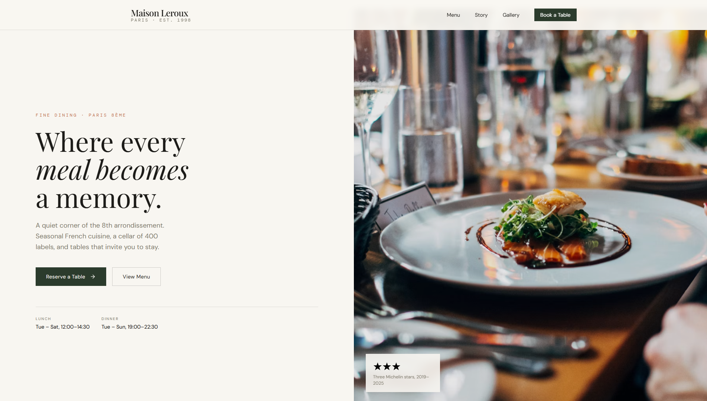

# 🍽️ Restaurant Landing Page

A modern and responsive **restaurant landing page** built with **Tailwind CSS** and **Vanilla JavaScript**.

This project focuses on creating a clean, attractive, and responsive restaurant website with an emphasis on modern UI design and smooth user interactions.

---

## 🔗 Live Demo

**[View Live Demo](https://mehrzad-sepehran.github.io/Restaurant-Landing-Page/)**

---

## 📸 Preview

### Desktop

### Phone

---

## 🛠️ Technologies

- **Tailwind CSS** — Styling and responsive layout
- **JavaScript** — Interactions and dynamic functionality
- **HTML5** — Page structure

---

## 👨‍💻 Author

**Mehrzad Sepehran**

Front-End Developer focused on building modern and responsive web experiences.

- GitHub: [@Mehrzad-Sepehran](https://github.com/Mehrzad-Sepehran)

---

⭐ If you like this project, consider giving it a star!
